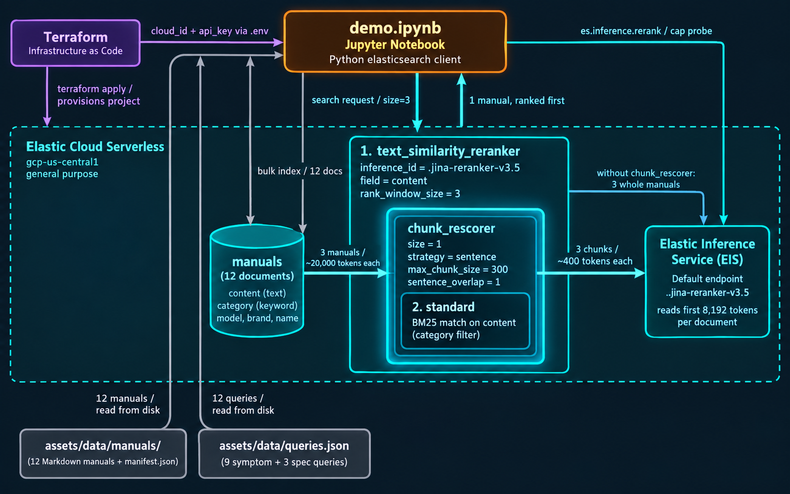
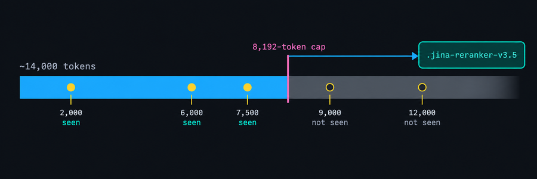
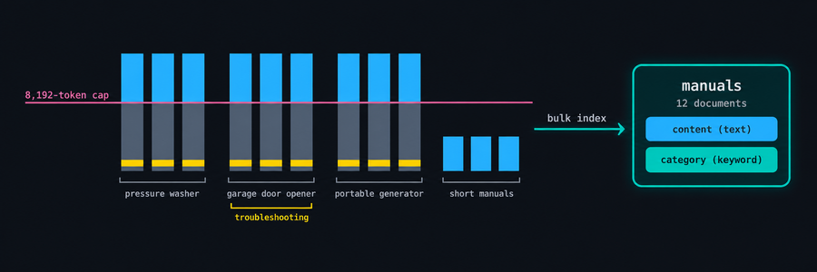
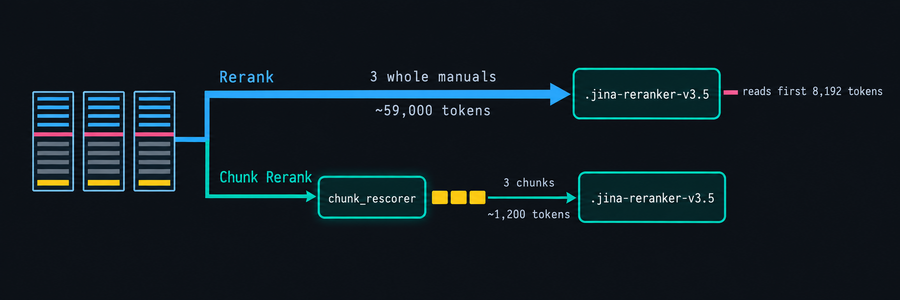
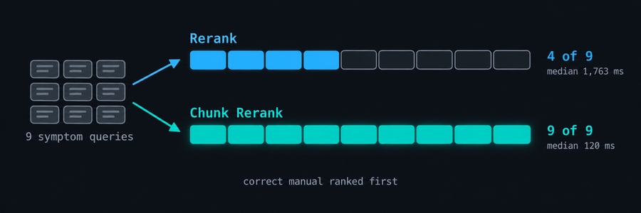
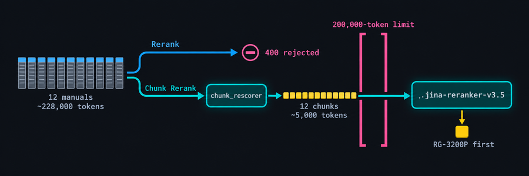
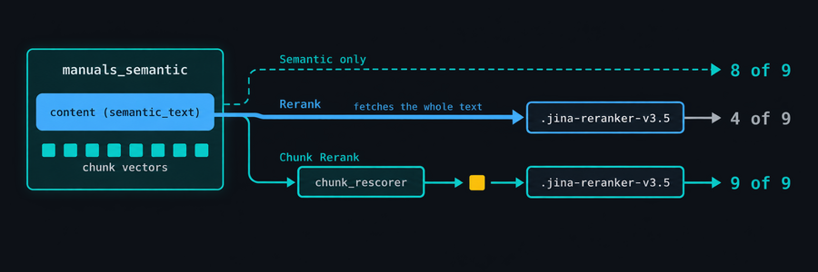
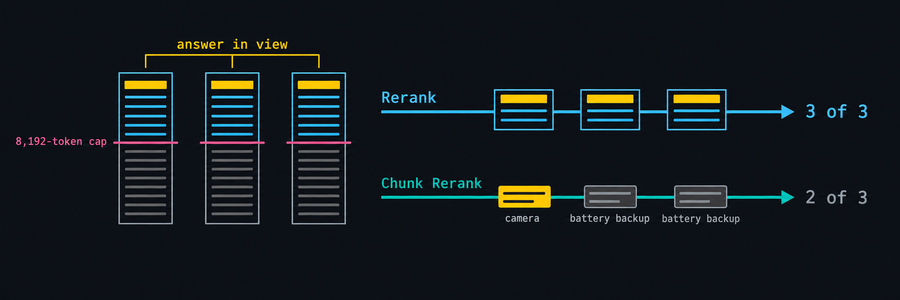

# What Your Reranker Never Sees
*Elasticsearch's chunk_rescorer sends a reranker the best-matching chunk instead of a truncated document.*

This article is the third in a series I've written on chunking in Elasticsearch.  Previous chunking articles:
- [Chunking Strategies](https://www.linkedin.com/pulse/elasticsearch-chunking-agentic-ai-choosing-right-strategy-joey-whelan-qjz5c/)
- [Late Chunking](https://www.linkedin.com/pulse/late-chunking-tool-upgrade-joey-whelan-magxc/)

This one focuses on the use of the `chunk_rescorer` parameter of the [text_similarity_reranker](https://www.elastic.co/docs/reference/elasticsearch/rest-apis/retrievers/text-similarity-reranker-retriever).  This parameter overrides the default behavior of the reranker retriever, which evaluates the entire content of the chosen rerank field.  With `chunk_rescorer` enabled, the field is chunked first, each chunk is scored against the query lexically on the shard, and only the best chunk(s) are sent to the reranker.  

Rerankers have fixed token limits.  Many, including jina-reranker-v3.5, silently truncate: only the tokens within the limit get evaluated.  If the salient piece of information is beyond that limit, the reranker never sees it.  `chunk_rescorer` is a way to ensure that information makes it to the reranker.

---

## What This Article Covers

- Elastic Serverless deployment via Terraform
- Demonstration of a reranker (jina-reranker-v3.5) token cap
- Demonstration of late-in-document and token-overrun rerank scenarios for both rerank-only and chunk reranking
- Demonstration of the value of `chunk_rescorer` in both lexical and semantic searches with reranking
- Explanation of when `chunk_rescorer` is not a good idea

---

## Business Value
- Long document fields get truncated before the reranker sees the relevant passage.  Sending the best chunk instead increases relevance: in the demo, four of nine correct became nine of nine.
- No re-architecture is necessary to implement this. It's simply an option on the reranker retriever in the search request; the index is untouched.
- This technique yields faster and cheaper reranking: about ten times less rerank time and payload in the demo. 
- We get a wider rerank window. Whole documents exhaust it after a handful of candidates. Chunks allow ranking of the entire catalog.

---

## Architecture


---

## The Cap, Measured


The entire basis of this demo/article rests on one claim: jina-reranker-v3.5, as served by the Elastic Inference Service (EIS), reads roughly the first 8,192 tokens of a document and discards the rest.  Below are the results from a needle-in-filler test.  The document is ~14,000 tokens of unrelated filler, and the marker is the correct answer to the query, inserted at a chosen position.  I push that marker further and further back in the document until it's clear the reranker no longer sees it.  Past roughly 8,192 tokens the document is truncated by the reranker and the marker is never seen.

```text
 marker at  seen?
     2,000  yes
     6,000  yes
     7,500  yes
     9,000  no
    12,000  no
```
---

## Load and Index the Corpus


- The scenario is a hardware retailer's support search: a shopper types a symptom, and the right answer is the manual whose troubleshooting section lists that fault.
- I create a synthetic set of twelve product manuals:  three product categories with three same-brand models each (pressure washers, garage door openers, portable generators), plus three short manuals (a drill, a thermostat, a hose reel). 
- For a given category, the three models have the same safety section word for word and similar operation sections such that the first 8,000 tokens are alike.  
- The troubleshooting section of each has exactly one fault its siblings do not.  The subsequent test scenarios use this trait to demonstrate what happens with/without chunk rescoring.
- The last three are short manuals that fit under the cap.  They fill out the catalog for the request-limit test and show that the cap is not a concern for short documents.

```text
model      category                tokens  troubleshooting at  past the cap?
RG-3200P   pressure washer         23,563              19,618  yes
RG-2600P   pressure washer         20,040              16,287  yes
RG-4000P   pressure washer         15,622              11,670  yes
KG-1200B   garage door opener      34,774              26,047  yes
KG-800C    garage door opener      26,069              20,235  yes
KG-1500W   garage door opener      30,867              25,754  yes
RG-7500E   portable generator      19,435              14,536  yes
RG-4500E   portable generator      21,205              16,670  yes
RG-10000D  portable generator      22,598              18,148  yes
NF-D20B    cordless drill/driver    4,827               3,814  no
KT-7W      smart thermostat         6,077               4,408  no
NF-HR100   hose reel                2,804               2,234  no
```
---

## Two Retriever Configurations


- I configure two retriever scenarios: a default reranker and a reranker with `chunk_rescorer` configured.
- Under Rerank, I send the entire content of each of the three manuals to `.jina-reranker-v3.5` in one request.
- As mentioned above, the troubleshooting section of each manual is far beyond the 8,192-token reranker limit.

```python
def first_stage(q, category):
    """The manuals of the category the shopper is browsing."""
    return {"standard": {"query": {"bool": {
        "filter": [{"term": {"category": category}}],
        "must": [{"match": {"content": q}}],
    }}}}


def rerank(q, category, window=3):
    """Rerank: send each manual whole to the reranker."""
    return {"text_similarity_reranker": {
        "retriever": first_stage(q, category),
        "field": "content",
        "inference_id": ".jina-reranker-v3.5",
        "inference_text": q,
        "rank_window_size": window,
    }}


def chunk_rerank(q, category, window=3, size=1):
    """Chunk Rerank: send only each manual's best-matching chunk(s)."""
    r = rerank(q, category, window)
    r["text_similarity_reranker"]["chunk_rescorer"] = {
        "size": size,
        "chunking_settings": {"strategy": "sentence", "max_chunk_size": 300, "sentence_overlap": 1},
    }
    return r
```

**What the results show, and why**

- **Rerank ranks the three manuals almost identically.** That does not mean reranking is working here.  What is happening is that the manuals look the same for the first ~8,000 tokens.  The reranker never sees the troubleshooting section and hence never differentiates the correct manual for this query.
- **Chunk Rerank separates them decisively.** The correct manual scores around 1.67 against about 1.0 for the other two, a gap of over 0.5. The reranker is now comparing an answer against two non-answers, and it says so.
- **Chunk Rerank is also about ten times faster.** Rerank ships the three whole manuals to EIS, about 59,000 tokens for this category, and the model reads the first ~8,000 of each. Chunk Rerank ships three chunks of ~400 tokens, about 1,200 in total. The reranker's time scales with what it is given, and the payload and cost drop with it.

***Results***
```text
Query:    "pressure washer pump drips from weep hole when trigger released"
Answer:   RG-3200P is the manual whose troubleshooting section has this fault

Rerank        whole manuals
   reranker saw: the first ~8,000 tokens of each of the 3 manuals
   took:         1,821 ms
   #1   RG-3200P   pressure washer        score 1.148  <- correct
   #2   RG-2600P   pressure washer        score 1.120
   #3   RG-4000P   pressure washer        score 1.100
   verdict:      correct manual first, 0.03 ahead of #2 -> a near tie: the reranker could not really tell them apart

Chunk Rerank  best chunk only
   reranker saw: the ~400-token chunk of each manual that best matches the query
   took:         122 ms
   #1   RG-3200P   pressure washer        score 1.665  <- correct
   #2   RG-4000P   pressure washer        score 1.091
   #3   RG-2600P   pressure washer        score 0.988
   verdict:      correct manual first, 0.57 ahead of #2 -> a clear call
```
---

## Run the Queries


- This section runs all nine symptom queries through both retriever configurations.
- There are three symptoms per product category.  Each is written so that exactly one model's troubleshooting section answers it.
- All troubleshooting sections are past the reranker's token cap.
- For each query the table gives the rank of the correct manual, its margin over the best other manual, and Elasticsearch's own time for the call. A margin under about 0.05 in either direction is a tie the reranker broke by chance.

**What the results show, and why**

- **Rerank: about a third, by noise.** Rerank finds the correct manual first on four of nine, and two of those four are by less than 0.05. 
- **Chunk Rerank: all nine, by wide margins.** Margins run from about 0.4 to 0.7 on eight of them, because the chunk sent for the correct manual is the troubleshooting entry and the chunks sent for its siblings are generic passages.
- **Time.** Chunk Rerank's median is well under a tenth of Rerank's, because each Chunk Rerank request carries about 1,200 tokens against three whole manuals.

***Results***
```text
query                    answer    |         Rerank         |      Chunk Rerank     
                                   |    rank  margin     ms |    rank  margin     ms
------------------------------------------------------------------------------------
pw-inlet-screen          RG-2600P  |      #1   +0.09  1,716 |      #1   +0.43    121
pw-weep-hole             RG-3200P  |      #1   +0.03  1,736 |      #1   +0.57    113
pw-milky-oil             RG-4000P  |      #3   -0.06  1,763 |      #1   +0.64    116
gdo-chain-sag            KG-800C   |      #2   -0.25  1,844 |      #1   +0.37    120
gdo-3-1-pattern          KG-1200B  |      #2   -0.01  1,859 |      #1   +0.45    131
gdo-camera-black         KG-1500W  |      #1   +0.03  1,818 |      #1   +0.60    113
gen-fuel-valve-detent    RG-4500E  |      #3   -0.16  1,754 |      #1   +0.66    125
gen-twistlock-breaker    RG-7500E  |      #3   -0.11  1,732 |      #1   +0.04    130
gen-propane-stall        RG-10000D |      #1   +0.42  1,967 |      #1   +0.56    116

Rerank: correct manual first in 4 of 9 (2 of them by less than 0.05, i.e. a near tie); median Elasticsearch time 1,763 ms
Chunk Rerank: correct manual first in 9 of 9 (1 of them by less than 0.05, i.e. a near tie); median Elasticsearch time 120 ms
```
---

## The Request Limit


- The previous tests keep the rerank window confined to three manuals, with the presumption that the shopper was browsing one category.  
- This test shows what happens when the rerank window cannot be confined:  the entire manual set is sent for reranking.
- Jina refuses requests whose estimated total exceeds 200,000 tokens.  These twelve manuals come to ~228,000 tokens.
- Rerank cannot process this input at all.  The request is rejected.
- Chunk Rerank narrows the input to the reranker so that it is far below the limit.

**What the results show, and why**

- **Rerank is rejected in a fraction of a second.** The message is Jina's: "Request too large; estimated total tokens exceed the maximum limit of 200,000." Nothing was scored.
- **Chunk Rerank ranks the catalog correctly.** The RG-3200P is first by about 0.7, with the other two pressure washers next and the nine unrelated manuals below them. 

```text
Rerank        whole manuals, whole catalog
   reranker saw: nothing: 12 whole manuals, ~228,000 tokens, refused before inference
   status:       400 BadRequestError
   reason:       Request too large; estimated total tokens exceed the maximum limit of
                 200,000. Reduce document count or document sizes.
   verdict:      no ranking at all -> this configuration cannot rerank a window this large

Query:    "pressure washer pump drips from weep hole when trigger released"
Answer:   RG-3200P is the manual whose troubleshooting section has this fault

Chunk Rerank  best chunk only, whole catalog
   reranker saw: one ~400-token chunk from each of the 12 manuals
   took:         269 ms
   #1   RG-3200P   pressure washer        score 1.745  <- correct
   #2   RG-4000P   pressure washer        score 1.057
   #3   RG-2600P   pressure washer        score 0.999
   #4   NF-HR100   hose reel              score 0.935
   #5   KG-1200B   garage door opener     score 0.929
   #6   NF-D20B    cordless drill/driver  score 0.927
   #7   RG-7500E   portable generator     score 0.899
   #8   RG-10000D  portable generator     score 0.889
   #9   KG-800C    garage door opener     score 0.881
   #10  KG-1500W   garage door opener     score 0.880
   #11  KT-7W      smart thermostat       score 0.828
   #12  RG-4500E   portable generator     score 0.823
   verdict:      correct manual first, 0.69 ahead of #2 -> a clear call
```
---

## Does semantic_text Avoid This?


- The previous tests were confined to lexical queries on text fields.  This test shows that the same behavior (token overrun) happens with semantic queries on `semantic_text` fields as well.
- A reranker is a cross-encoder.  It operates on text, the query and the document together, not on vectors.  
- The net effect is that the original text is fetched here, just as with the plain text field.  The whole manual gets presented to the reranker and we have the token overrun, again.

**What the results show, and why**

- **Retrieval by best chunk works.** The semantic query alone puts the correct manual first on eight of nine. Scoring each manual by its best chunk finds the troubleshooting entry wherever it sits, which is exactly the property `semantic_text` is meant to have. 
- **The whole-manual reranker throws that away.** Rerank on the `semantic_text` field falls to four of nine, and its ranks and margins are identical to the Run the Queries results on the plain text field, query for query. 
- **Chunk Rerank restores it.** Nine of nine, at about a tenth of the whole-manual time. 
- **How the two chunkings relate.** `semantic_text` chunks for retrieval and `chunk_rescorer` chunks for reranking, and they are separate decisions. The first decides which manuals reach the rerank window; the second decides what the reranker reads about each. A semantic first stage does not remove the need for the second.

***Results***
```text
query                    answer    |     Semantic only      |         Rerank         |      Chunk Rerank     
                                   |    rank  margin     ms |    rank  margin     ms |    rank  margin     ms
-------------------------------------------------------------------------------------------------------------
pw-inlet-screen          RG-2600P  |      #1   +0.01    134 |      #1   +0.09  1,838 |      #1   +0.43    199
pw-weep-hole             RG-3200P  |      #1   +0.01     78 |      #1   +0.03  1,845 |      #1   +0.57    190
pw-milky-oil             RG-4000P  |      #1   +0.05     77 |      #3   -0.06  1,822 |      #1   +0.64    191
gdo-chain-sag            KG-800C   |      #1   +0.02     72 |      #2   -0.25  1,964 |      #1   +0.37    213
gdo-3-1-pattern          KG-1200B  |      #1   +0.02     69 |      #2   -0.01  1,902 |      #1   +0.45    214
gdo-camera-black         KG-1500W  |      #1   +0.04     72 |      #1   +0.03  1,953 |      #1   +0.60    190
gen-fuel-valve-detent    RG-4500E  |      #2   -0.01     80 |      #3   -0.16  1,845 |      #1   +0.66    202
gen-twistlock-breaker    RG-7500E  |      #1   +0.03     83 |      #3   -0.11  1,815 |      #1   +0.04    195
gen-propane-stall        RG-10000D |      #1   +0.05     71 |      #1   +0.42  1,818 |      #1   +0.56    196

Semantic only: correct manual first in 8 of 9 (6 of them by less than 0.05, i.e. a near tie); median Elasticsearch time 77 ms
Rerank: correct manual first in 4 of 9 (2 of them by less than 0.05, i.e. a near tie); median Elasticsearch time 1,845 ms
Chunk Rerank: correct manual first in 9 of 9 (1 of them by less than 0.05, i.e. a near tie); median Elasticsearch time 196 ms
```
---

## When the Answer Is Already in View


- Chunk Rerank helps when the relevant passage is past the reranker's cap.  If the answer is within the cap, the reranker sees it either way.  In this test, the queries ask for something within the cap.
- The difference is what the reranker sees: the whole document under Rerank and ~400 tokens under Chunk Rerank.  This is the one situation where whole documents can do better.

**What the results show, and why**

- **Rerank gets all three.** The specification that answers each query sits in the first few thousand tokens of the manual, in view.
- **Chunk Rerank gets two and loses the camera.** The camera query asks for two features: a camera, which only the KG-1500W has, and battery backup, which all three openers have. Chunk selection picks a battery-backup passage from each sibling and a camera passage from the KG-1500W, and the reranker has to judge those three passages alone. Nothing in a passage can tell it that two of the manuals never mention a camera. 
- **The general point.** Chunking finds one distinguishing passage wherever it sits. It gives up the document-level view a listwise reranker uses when the answer depends on combining what a document says with what it does not say. If the answers to your queries live in the visible head, whole documents are as good or better, and Chunk Rerank is only buying you latency.

```text
pw-spec-4000psi    "which pressure washer is rated 4,000 PSI"
gdo-spec-camera    "garage door opener with built-in camera and battery backup"
gen-spec-propane   "generator that can run on propane"

query                    answer    |         Rerank         |      Chunk Rerank     
                                   |    rank  margin     ms |    rank  margin     ms
------------------------------------------------------------------------------------
pw-spec-4000psi          RG-4000P  |      #1   +0.34  1,795 |      #1   +0.43    117
gdo-spec-camera          KG-1500W  |      #1   +0.06  1,852 |      #3   -0.10    119
gen-spec-propane         RG-10000D |      #1   +0.28  1,724 |      #1   +0.29    131

Rerank: correct manual first in 3 of 3; median Elasticsearch time 1,795 ms
Chunk Rerank: correct manual first in 2 of 3; median Elasticsearch time 119 ms
```

---

## Summary

- **The reranker cap is a real consideration for long documents, like product manuals.** The reranker ends up guessing when the documents in the rerank window look alike due to truncation.
- **Chunk Rerank provides the fix.** The same nine queries, nine correct, most by margins of 0.4 to 0.7.
- **It also unlocks the rerank window.** The reranker request is capped at 200,000 estimated tokens. Chunk Rerank returned correct results where Rerank was rejected for exceeding the token limit.
- **`semantic_text` is not exempt.** Putting the whole-manual reranker on top gave the same poor results as with the lexical first stage.  Chunk Rerank scored perfectly.  
- **One limit to respect.** When the answer is in the visible head, Rerank alone can perform better than Chunk Rerank. Chunking trades the document-level view for a single passage, and that trade only pays when the passage is out of view.

**Two ways to solve this problem**

- **Query-time chunking, chunks stay with the document.** `chunk_rescorer` keeps the document as the unit and chunks the text the reranker reads, at query time.
  - Pros: no re-indexing, it is one option on a text field you already have; results are still documents with their metadata; retrieval chunking and reranking chunking are separate decisions.
  - Cons: chunk selection is lexical, so a semantic first stage can find the document and the rescorer can still miss the passage; the chunking is redone on every query for every document in the rerank window.
- **Ingest-time chunking, chunk is the record.** The alternative, which other search platforms take, is to chunk at ingest and make the chunk the record: retrieval returns chunks, and the reranker ranks chunks.
  - Pros: the reranker limit is a non-issue by construction; chunking is done once and can be document-aware; chunk selection is semantic because retrieval already returned the matching chunks; chunks carry their own vectors and metadata.
  - Cons: the corpus must be re-indexed as chunks before any of it works; results are chunks, so turning them back into ranked, deduplicated documents with their metadata is your code; the per-record limits on such rankers tend to be far tighter than a document; and one chunking serves both retrieval and reranking, so changing it means re-indexing.

---

## Source

Full source code on [GitHub](https://github.com/joeywhelan/chunk-rescorer).

---